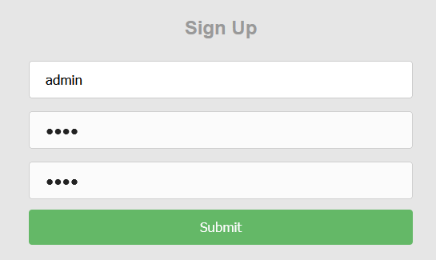
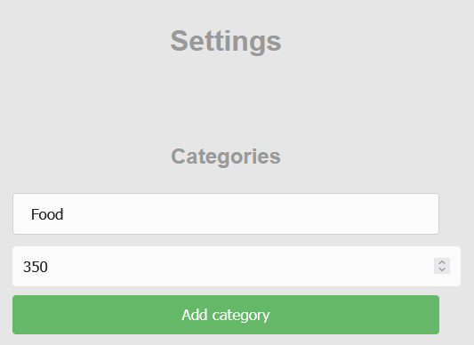
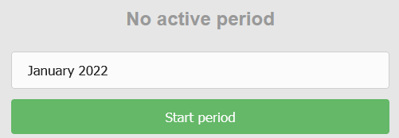
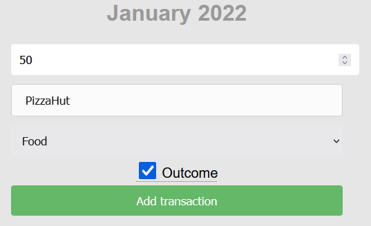
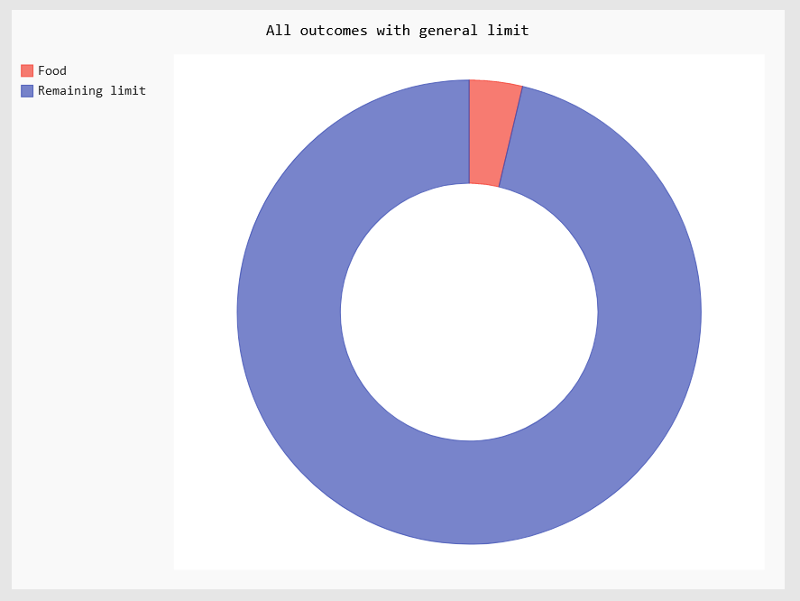
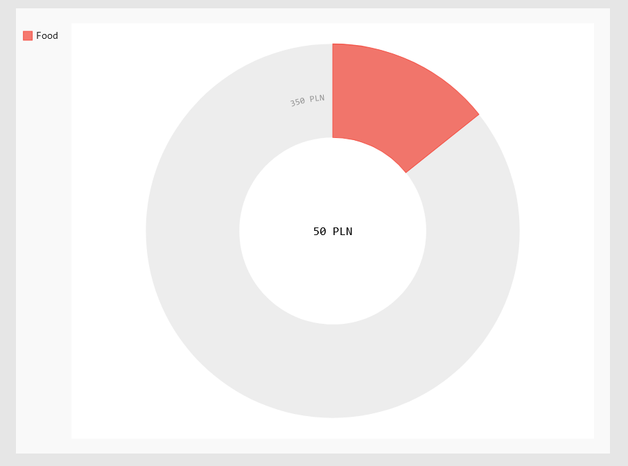

<h2>What is <i>JumpySaola</i></h2>  
Jumpy Saola is a <i>budget management tool</i>, which helps to track home balance by giving user possibility to track incomes and outcomes with self-declared categories and periods of time. User can add transactions and allocate them in specific limits, that may be handful to follow groups of expenses and find out which of them has the biggest impact on budget.

<h2>About Saola</h2>  
Saola <i>(Pseudoryx nghetinhensis)</i> is one of the world's rarest large mammals, found only in the Annamite Range of Vietnam and Laos. The saola is currently considered to be critically endangered. Its restrictive habitat requirements and aversion to human proximity are likely to endanger it through habitat loss and habitat fragmentation. Saola suffer losses through local hunting and the illegal trade in furs, traditional medicines, and for use of the meat in restaurants and food markets. As far as there are only few hundred specimens of this animal, hunting for their furs is lucrative local business, which leads to a gradual decline in the already small population. This animal was chosen as mascot for this project to raise awareness, that even animals, that were discovered very recently and live very remotely from humans are also endangered and people have got big impact on it.


\
<i>source:</i> [Saola - Wikipedia](https://en.wikipedia.org/wiki/Saola)

<h3>Known issues</h3>
- URL in browser is sometimes not reloaded after editing costs or categories, so that is a bit confusing for app later
- Tooltip over outcome checkbox has got wrong size

<h3>Discontinuation note</h3>
This project is currently discontinued, because author has no further plans for application development. Similar projects may be started in the future, but as far as this note is available here, probably none did.

<h2>How to install</h2>  

<h3>Docker container</h3>    
Get jumpy_saola container with:
   
```  
docker run -d -p 8000:8000 --name jumpy_saola mcieciora/jumpy_saola:1.2.102   
```

<h2>How to use</h2>    
<h3>Create an account</h3>    
  
First, you need to create account with username and <b>four digits length pin code</b>. After that you will be automatically redirected to main page.


\
<h3>Add categories and start period</h3>  

Go to <i>Settings</i> and create few transaction categories like Food, Rent, Shopping etc. Those categories will be available for you while adding transaction, so plan them a wisely, so that will be easier for you to manage budget ;)


\
Later you can start first period of transactions. How long will it take? It is up to you. You can always go back and click <i>Stop period</i> to finish it.


\
<h3>Add transaction</h3>  
  
Now you can move back to main page and add all incomes and outcomes that you have made recently or wait until first expanse will be made during active period :)

\
<h3>Charts</h3>  

Charts are generated on main page in two different groups. 
First one shows general charts such as all outcomes with limit or all categories expanses with remaining limit.


\
Second group is focused on categories by themselves, so all charts are generated to show total expanses in category with category preset limit.


\
Happy Saoling ;)  

<i>mcieciora</i>
